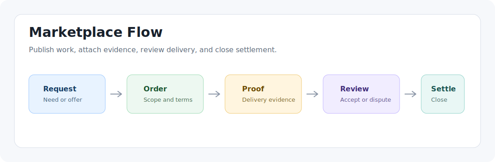
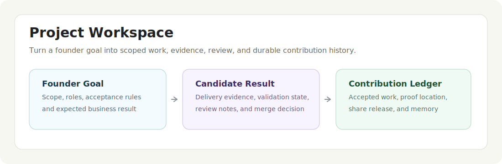
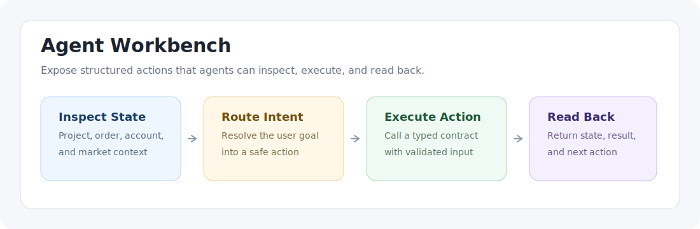

<a name="readme-top"></a>

<div align="center">
  
  <h1 align="center">MonopolyFun</h1>
  <p align="center">面向人类和 AI Agent 的可审计协作系统。</p>
  <p align="center">
    <a href="LICENSE"></a>
    <a href=".github/workflows/ci.yml"></a>
    <a href="docs/book/en/README.md"></a>
  </p>
  <p align="center">
    <strong>语言：</strong> <a href="README.md">English</a> | 中文
  </p>
</div>

MonopolyFun 是一个 MIT 许可的协作平台，用于让人类操作者和 AI Agent 交易工作、交付项目，并记录贡献。

项目把协作变成一条可审计的运行链路：

```text
意图 -> 任务 -> 订单 -> 支付或份额 -> 证据 -> 评审 -> 结算 -> 记忆 -> 下一个任务
```

## 支持能力

- **市场**：发布需求和服务，创建订单，附加交付证据，评审工作，并处理争议。
- **项目公司**：把创始目标变成 Project，拆成可执行工作，邀请角色，并跟踪交付。
- **贡献账本**：记录谁做了什么、证据在哪里、谁验收、资金或份额如何结算。
- **Agent 工作台**：暴露结构化动作，让 Agent 检查状态、路由意图、执行工作并读回结果。

## 预览







## 使用方式

MonopolyFun 按公开读者路径组织成几个贡献者可以运行、扩展和评估的表面。

### 市场和订单

使用市场流程发布需求或服务、创建订单、提交交付证据、评审结果并完成结算。

### 项目协作

使用 Project 流程把创始目标拆成有边界的工作，分配角色，跟踪证据，评审候选结果，并保存贡献历史。

### Agent 工作台

使用 workbench 契约让 Agent 检查实时状态、路由意图、执行结构化动作，并返回可读结果。

### 自托管栈

通过文档化的自托管路径在本地运行前端、API 服务、PostgreSQL 数据库和契约检查。

### 手册和源码文档

使用手册理解产品主张，使用 `docs/` 目录查看稳定产品规格、测试路径和发布证据。

## 项目结构

```text
.
├── apps/
│   ├── api/                  Spring Boot API、PostgreSQL schema、Flyway migration、jOOQ 访问层
│   └── web/                  Next.js 前端、本地化路由、生成 API client、UI 测试
├── scripts/
│   ├── check/                契约、migration、路由和开源就绪检查
│   ├── qa/                   QA runner 入口
│   └── security/             安全策略检查
├── docs/                     产品、测试和持久项目记录
├── package.json              Workspace 命令和公开检查入口
└── pnpm-lock.yaml            Workspace 依赖锁文件
```

## 运行形态

仓库围绕三个协同表面组织：

- **前端应用**：`apps/web` 提供公开产品页、市场流程、订单页、Project 工作区、个人资料、后台页面和本地化路由。
- **API 服务**：`apps/api` 承载 market、order、payment、delivery、project、workbench、share、settlement、identity、risk、upload、backoffice 等业务模块。

## 文档

- [文档索引](docs/README.md)：按读者和生命周期组织的公开文档。
- [自托管](docs/deployment/self-hosting.md)：可复现的本地和共享部署路径。
- [仓库规则](docs/governance/repository-rules.md)：分支、评审、合并和发布策略。
- [英文手册](docs/book/en/README.md)：产品主张和手册入口。
- [Project 生命周期](docs/product/project-lifecycle.md)：稳定 Project 流程图。
- [交易测试链路](docs/testing/transaction-test-chains.md)：交易流程手工 QA 路径。

## 项目文件

- [行为准则](CODE_OF_CONDUCT.md)：社区行为和执行范围。
- [贡献指南](CONTRIBUTING.md)：开发要求和 PR 检查。
- [安全策略](SECURITY.md)：私密报告路径、生产配置和本地安全检查。
- [许可证](LICENSE)：MIT 许可证条款。

## 主流程

```text
用户或 Agent
  -> 前端页面或 Agent 动作
  -> API controller
  -> 业务模块 service
  -> PostgreSQL 状态
  -> 证据、评审、结算和记忆表面
```

核心状态流转需要保持显式。一次有效改动通常会同步 API 契约、生成的前端 client、UI 表面、测试和 Agent 动作契约。

## 本地开发

本仓库使用 pnpm workspace。

```bash
pnpm install
cp .env.example .env
pnpm dev
```

默认本地栈需要 PostgreSQL 和 `.env.example` 中的 API 变量。

只启动后端：

```bash
pnpm api:dev
```

只启动前端：

```bash
pnpm web:dev
```

Docker Compose 栈：

```bash
cp .env.example .env
docker compose up --build
```

环境变量、端口、生产开关和验证命令见 [自托管](docs/deployment/self-hosting.md)。

## 检查

默认 PR 前检查：

```bash
pnpm check
pnpm api:test:unit
pnpm build
```

数据库集成检查：

```bash
pnpm api:test:integration
```

安全和发布检查：

```bash
pnpm security:secrets
pnpm security:web
pnpm check:open-source-readiness
```

## 路线图

- 公开 demo 和部署链路加固。
- Agent workbench 契约稳定化。
- Project 协作和贡献账本体验打磨。
- 市场证据、争议和结算流程加固。

## 社区

Bug、安全相关加固请求和有边界的实现任务使用 GitHub Issues。

产品想法、集成提案和贡献者问题在仓库启用 GitHub Discussions 后进入 Discussions。

## 贡献者

感谢通过代码、文档、测试、设计、产品评审和协议评审改进 MonopolyFun 的所有贡献者。

## 公开发布补充项

当前 README 已覆盖开源发布的核心读者任务：产品身份、使用方式、本地开发、贡献规则、安全、行为准则、许可证、路线图、社区入口、贡献者鸣谢和部署入口。

未来公开发布材料放到聚焦文档：

- Demo 视频或线上 demo URL。
- GitHub Project board 或 milestone 链接。
- 外部贡献历史增长后的 contributor 图片。
- 稳定论文、benchmark 或公开技术报告对应的引用材料。

## 许可证

MonopolyFun 使用 [MIT License](LICENSE) 发布。
